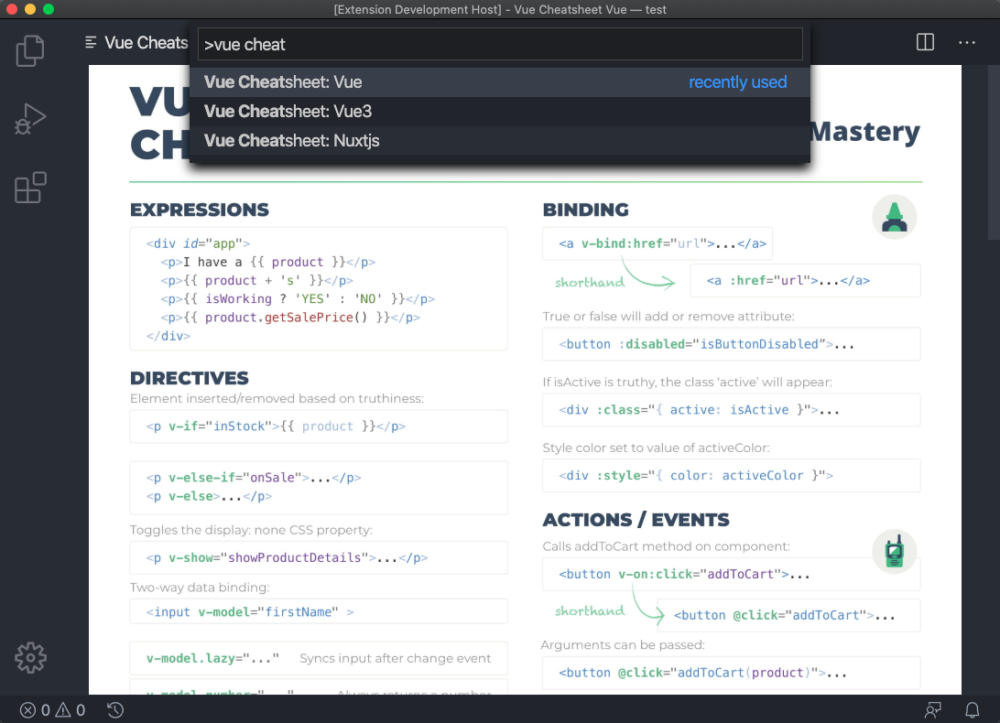

# [Vue Cheatsheet](https://marketplace.visualstudio.com/items?itemName=jojoee.vue-cheatsheet)
A Visual Studio Code extension that lets you open Vue Cheatsheet inside the editor.

## Features
- `Vue Cheatsheet: Vue` to open Vue Cheatsheet
- `Vue Cheatsheet: Vue3` to open Vue3 Cheatsheet
- `Vue Cheatsheet: Nuxtjs` to open Nuxtjs Cheatsheet

## Reference
- [Vue Mastery: Vue Cheat Sheet](https://www.vuemastery.com/vue-cheat-sheet/)
- [Vue Mastery: Vue 3 Cheat Sheet](https://www.vuemastery.com/vue-3-cheat-sheet)
- [Vue Mastery: Nuxt Cheat Sheet](https://www.vuemastery.com/nuxt-cheat-sheet)
